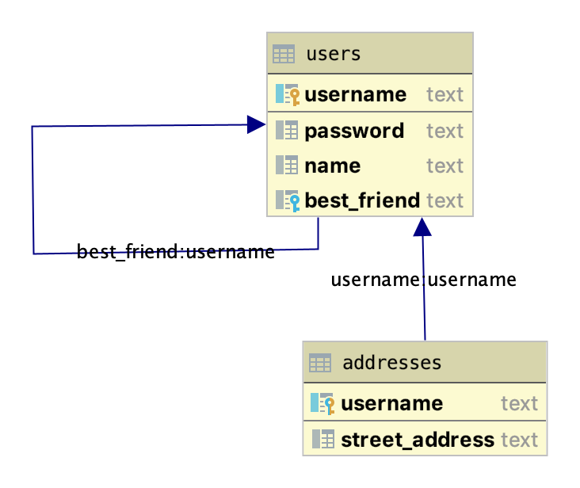
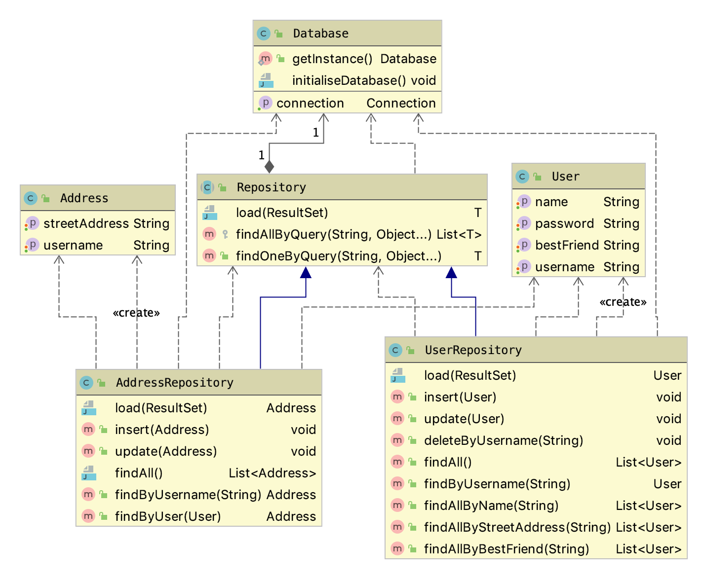
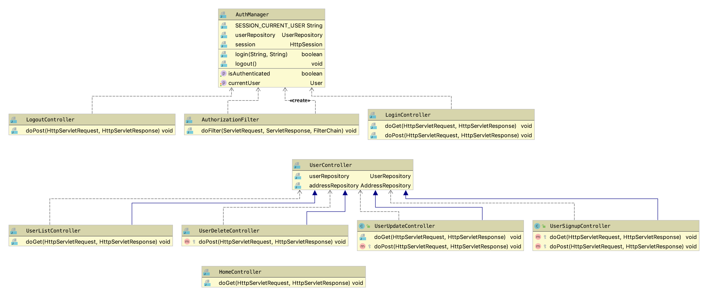

# SWE Persistency Patterns
The goal of this assignment is to design the architecture and provide a simple implementation for a web application that
supports the following functionality:
* Create, Read, Update and Delete (CRUD) operations for an entity that represents a user.
* A login operation.
* Search operations with three different search criteria: 
  - by name
  - by address
  - by name of the best friend
  
## Architecture
The first step in defining the architecture of the application has been to design its database schema. I tried to keep 
the complexity of the schema as low as possible, while providing all the necessary to demonstrate the required 
operations. The result can be seen in the figure below:

The technologies I adopted for this application are Java EE with Servlet and Java Server Pages. In addition, I used the 
JSTL library to implement the template views and the SQLite JDBC driver to connect to the database. I chose to use 
IntelliJ as my Integrated Development Environment. 

The application follows the Model View Controller (MVC) architecture, which divides the code in three major components.

### Model 
The Model component is responsible for storing the application data in domain objects and persisting them to the 
database. I decided to model it upon the Row Data Gateway pattern, since I believe it does a better job than Active 
Records at separating the persistency logic from the business logic in the code and it is somewhat simpler to implement. 
It results in sligtly less convenience for the users of the code, but a more straightforward behavior in my opinion, with
less hidden pitfalls.
 
It is composed of three parts:
* the `Database` class, which initialises the database and manages the database connections.
* the `User` and `Address` classes, which correspond to the Gateway instances. They are Plain Old Java Objects (POJOs), 
without any knowledge of the database nor any business logic.
* the `Repository` classes form the bridge between the database and the application code. Their resposibilities include 
executing the SQL instructions to insert, modify and query the data and mapping between database records and Java objects.

### Controller

