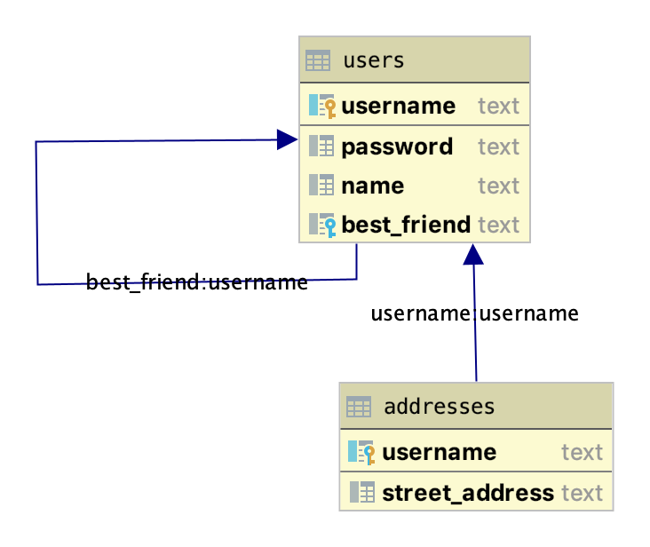
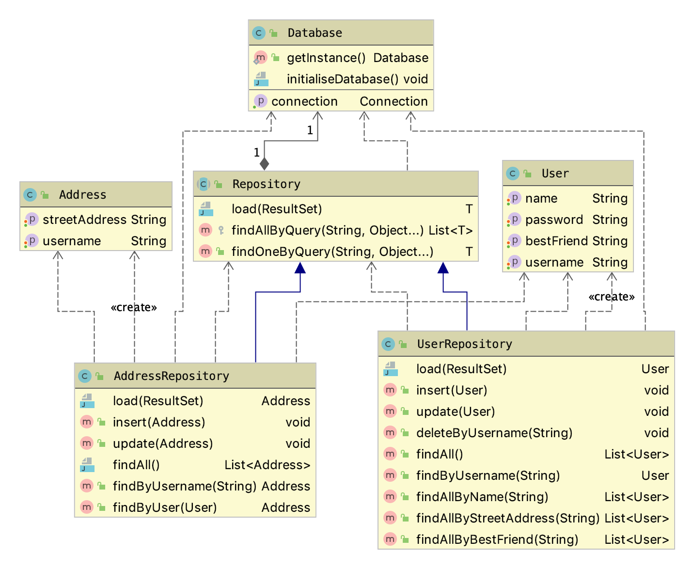
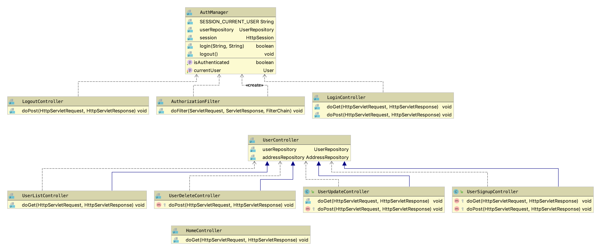
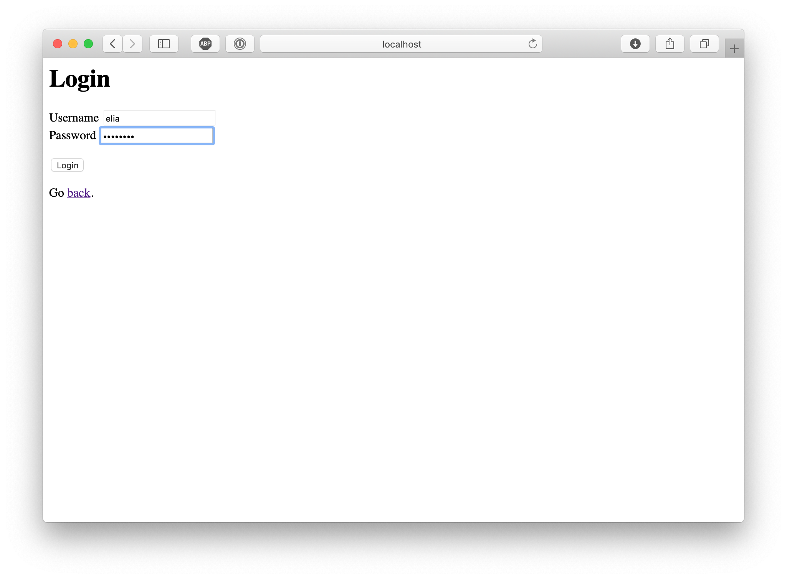
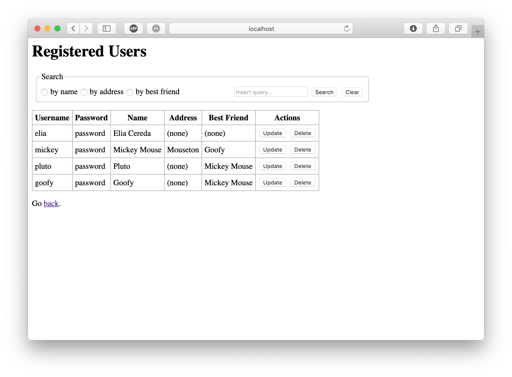
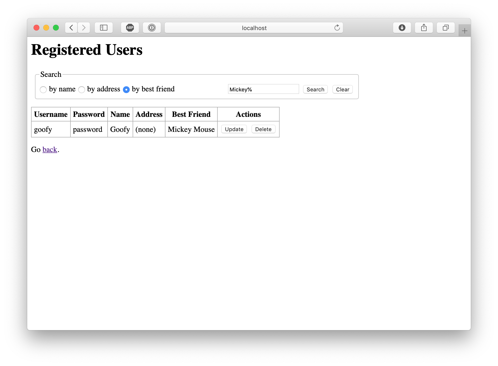
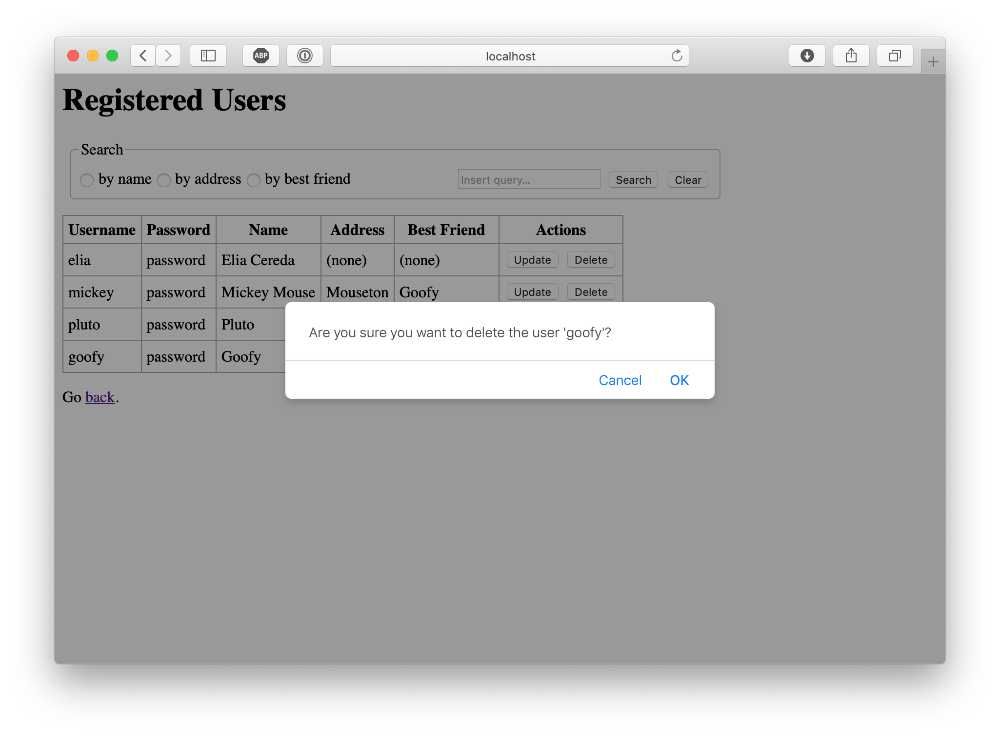
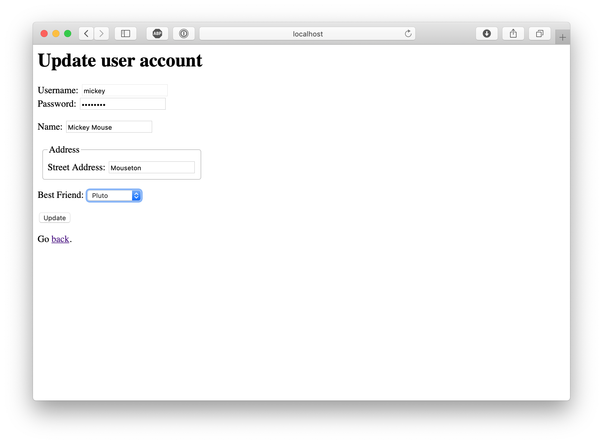

# SWE Persistency Patterns
The goal of this assignment is to design the architecture and provide a simple implementation for a web application that
supports the following functionality:
* Create, Read, Update and Delete (CRUD) operations for an entity that represents a user.
* A login operation.
* Search operations with three different search criteria: 
  - by name
  - by address
  - by name of the best friend
  
## Architecture
The first step in defining the architecture of the application has been to design its database schema. I tried to keep 
the complexity of the schema as low as possible, while providing all the necessary to demonstrate the required 
operations. The result can be seen in the figure below:

The technologies I adopted for this application are Java EE with Servlet and Java Server Pages. In addition, I used the 
JSTL library to implement the template views and the SQLite JDBC driver to connect to the database. I chose to use 
IntelliJ as my Integrated Development Environment. 

The application follows the Model View Controller (MVC) architecture, which divides the code in three major components.

### Model 
The Model component is responsible for storing the application data in domain objects and persisting them to the 
database. I decided to model it upon the Row Data Gateway pattern, since I believe it does a better job than Active 
Records at separating the persistency logic from the business logic in the code and it is somewhat simpler to implement. 
It results in sligtly less convenience for the users of the code, but a more straightforward behavior in my opinion, with
less hidden pitfalls.
 
It is composed of three parts:
* the `Database` class, which initialises the database and manages the database connections. It adopts the Singleton
pattern to ensure that only one instance is present in the application.
* the `User` and `Address` classes, which correspond to the Gateway instances. They are Plain Old Java Objects (POJOs), 
without any knowledge of the database nor any business logic.
* the `Repository` classes form the bridge between the database and the application code. Their resposibilities include 
executing the SQL instructions to insert, modify and query the data and mapping between database records and Java objects.

### Controller
The Controller component is responsible for implementing the business logic of the application and coordinating the 
presentation to the user. It uses the Java EE implementation of the Front Controller pattern: a `Servlet` per page is 
registered with the system, which then recevies the user requests and dispatches them to the correct `Servlet` based on 
the url patterns specified in the `@WebServlet` annotations. The servlets inherits from common superclasses, as needed,
to maximize the reuse of code across them.

The Intercepting Filter pattern is also applied in the `AuthorizationFilter` class, a filter which intercepts all 
incoming requests and augments them with an `AuthManager` instance, containing information about the current user 
session. Furthermore, the filter implements access control, checking that the user has the privileges to access the 
requested pages.

### View
The View component generates the final HTML code that is sent to the browser and shown to the user. It follows the 
Template View pattern, in which the pages are HTML with the addition of special code executed server-side to insert the 
dynamic parts.

The Controller responsible for a given page collects all the necessary dynamic information and attaches them to the 
`ServletRequest` object. Then, using the JSP dispatcher, control is passed to the template which outputs them in the
correct form.

## User Interface
Below are shown some screenshots that demonstrate the operation of the application.

### Login

### User List

### Search Results

### Delete User

### Update User

